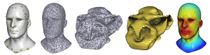
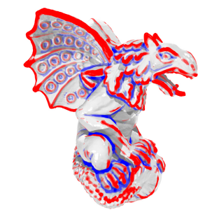

# A Survey on Work Related to Direction Field

Here is a list of related work on **direction field** that I have collected and complied.
I'm still working on it, so some of the information may not be complete.
I will update this list on a regular basis.

The emoji :white_check_mark: after the `[code]` or `[exe]` indicates that this code has been verified by me to be valid.

:clap: If you have any suggestions for improvements, please raise an issue or contact me.

# :page_with_curl: Papers

<table>
<!-- ----------------------------------------------------------------------------------- -->
<tr><td><td>

**Anisotropy and Cross Fields**

L. Simons, N. Amenta

05 August 2024, CGF

[[doi]](https://onlinelibrary.wiley.com/doi/10.1111/cgf.15132)
<!-- ----------------------------------------------------------------------------------- -->
<tr><td><td>

**Metric-Driven 3D Frame Field Generation**

[Xianzhong Fang], [Jin Huang], Yiying Tong, [Hujun Bao]

17 December 2021, TVCG

[[doi]](https://ieeexplore.ieee.org/document/9655471) [[exe]](https://github.com/xianzhongfang/MetricDrivenFrame3D)
<!-- ----------------------------------------------------------------------------------- -->
<tr><td><td>

**Practical 3D frame field generation**

[Nicolas Ray], Dmitry Sokolov, [Bruno Lévy]

05 December 2016, TOG

[[doi]](https://dl.acm.org/doi/10.1145/2980179.2982408) [[code - in AlgoHex]](https://github.com/cgg-bern/AlgoHex) [[code - in Supplemental materials]](https://dl.acm.org/doi/suppl/10.1145/2980179.2982408/suppl_file/233-0220.zip):white_check_mark:
<!-- ----------------------------------------------------------------------------------- -->
<tr><td><td>

**Frame field generation through metric customization**

Tengfei Jiang, [Xianzhong Fang], [Jin Huang], [Hujun Bao], Yiying Tong, Mathieu Desbrun

27 July 2015, TOG

[[doi]](https://dl.acm.org/doi/10.1145/2766927) [[pdf]](https://www.geometry.caltech.edu/pubs/JFHB+15.pdf) [[errata]](http://www.cad.zju.edu.cn/home/hj/15/metric/errata.pdf)
<!-- ----------------------------------------------------------------------------------- -->
<tr><td><td>

**Frame fields: anisotropic and non-orthogonal cross fields**

[Daniele Panozzo], [Enrico Puppo], [Marco Tarini], [Olga Sorkine-Hornung]

27 July 2014, TOG (SIGGRAPH 2014)

[[doi]](https://dl.acm.org/doi/10.1145/2601097.2601179) [[pdf]](https://cims.nyu.edu/gcl/papers/frame-fields-2014.pdf) [[project]](https://igl.ethz.ch/projects/frame-fields/) [[code - libigl]](http://www.inf.ethz.ch/personal/dpanozzo/libigl_tutorial/506_FrameField/main.cpp):no_entry_sign:
<!-- ----------------------------------------------------------------------------------- -->
<tr><td><td>

**Boundary aligned smooth 3D cross-frame field**

[Jin Huang], Yiying Tong, Hongyu Wei, [Hujun Bao]

12 December 2011, TOG

[[doi]](https://doi.org/10.1145/2070781.2024177) [[pdf]](https://dl.acm.org/doi/pdf/10.1145/2070781.2024177) [[video]](http://www.cad.zju.edu.cn/home/hj/11/3D-cross-frame.avi) [[exe]](http://www.cad.zju.edu.cn/home/hj/11/SH-cross-frame-1607-JiongCHEN.7z)
<!-- ----------------------------------------------------------------------------------- -->
<tr><td><td>

**Geometry-aware direction field processing**

[Nicolas Ray], Bruno Vallet, Laurent Alonso, [Bruno Levy]

15 December 2009, TOG

[[doi]](https://doi.org/10.1145/1640443.1640444) [[pdf]](https://dl.acm.org/doi/pdf/10.1145/1640443.1640444)
<!-- ----------------------------------------------------------------------------------- -->
<tr><td><td>

**N-symmetry direction field design**

[Nicolas Ray], Bruno Vallet, Wan Chiu Li, [Bruno Lévy]

08 May 2008, TOG

[[doi]](https://dl.acm.org/doi/abs/10.1145/1356682.1356683)
<!-- ----------------------------------------------------------------------------------- -->
<tr><td><td>

**Periodic global parameterization**

[Nicolas Ray], Wan Chiu Li, [Bruno Lévy], Alla Sheffer, Pierre Alliez

01 October 2006, TOG

[[doi]](https://dl.acm.org/doi/10.1145/1183287.1183297) [[pdf]](https://dl.acm.org/doi/pdf/10.1145/1183287.1183297)
<!-- ----------------------------------------------------------------------------------- -->
<tr><td><td>

**Robust Principal Curvatures on Multiple Scales**

Yong-Liang Yang, [Yu-Kun Lai], [Shi-Min Hu], Helmut Pottmann

2006, SGP

[[doi]](https://doi.org/10.2312/SGP/SGP06/223-226) [[pdf]](https://www.yongliangyang.net/docs/integralCurvature_sgp06.pdf)
<!-- ----------------------------------------------------------------------------------- -->
<tr><td><td>

**Smooth feature lines on surface meshes**

Klaus Hildebrandt, Konrad Polthier, Max Wardetzky

04 July 2005, SGP

[[doi]](https://dl.acm.org/doi/10.5555/1281920.1281935) [[pdf]](https://ddg.math.uni-goettingen.de/pub/feature.pdf) [[code?]](https://github.com/NYUGP17/SmoothFeatureLinesonSurfaceMeshes) [[code?]](https://github.com/Bushite/Smooth-Feature-Lines-Extraction)
<!-- ----------------------------------------------------------------------------------- -->
<tr><td><td>

**Restricted delaunay triangulations and normal cycle**

David Cohen-Steiner, Jean-Marie Morvan

08 June 2003, SCG

[[doi]](https://dl.acm.org/doi/abs/10.1145/777792.777839) [[pdf]](https://www.cs.jhu.edu/~misha/Fall09/Steiner03.pdf)
</table>

# :hammer: Other Projects

# :floppy_disk: Softwares

[Alexander Gao]: https://www.alexandergao.com/
[Alexander Sorkine-Hornung]: https://www.sornlex.com/
[Amir Vaxman]: https://avaxman.github.io
[Bruno Lévy]: https://brunolevy.github.io/
[Claudio Silva]: https://engineering.nyu.edu/faculty/claudio-silva
[Daniel Zint]: https://daniel-zint.github.io/
[Daniele Panozzo]: https://cims.nyu.edu/gcl/daniele.html
[David Bommes]: https://www.graphics.rwth-aachen.de/person/6/
[Denis Zorin]: https://cims.nyu.edu/gcl/denis.html
[Dong-Ming Yan]: https://people.ucas.ac.cn/~dmyan
[Enrico Puppo]: https://person.dibris.unige.it/puppo-enrico/
[Gang Xu]: https://faculty.hdu.edu.cn/jsjxy/xg/main.htm
[Hans-Christian Ebke]: https://www.graphics.rwth-aachen.de/person/10/
[Hsueh-Ti Derek Liu]: https://www.dgp.toronto.edu/~hsuehtil/
[Hujun Bao]: http://www.cad.zju.edu.cn/home/bao/
[Kenshi Takayama]: https://kenshi84.github.io/
[Leif Kobbelt]: https://www.graphics.rwth-aachen.de/person/3/
[L. Kobbelt]: https://www.graphics.rwth-aachen.de/person/3/
[Jin Huang]: http://www.cad.zju.edu.cn/home/hj/index.xml
[Marcel Campen]: https://graphics.cs.uos.de/
[M. Campen]: https://graphics.cs.uos.de/
[Marco Livesu]: http://pers.ge.imati.cnr.it/livesu/
[Marco Tarini]: https://tarini.di.unimi.it/
[Martin Marinov]: https://www.graphics.rwth-aachen.de/person/43/
[Max Lyon]: https://www.graphics.rwth-aachen.de/person/99/
[M. Lyon]: https://www.graphics.rwth-aachen.de/person/99/
[Maxence Reberol]: https://mxncr.github.io
[Ming C. Lin]: https://www.cs.umd.edu/~lin/
[Na Lei]: http://conformalgeometry.org/~lei/
[Nicolas Ray]: https://members.loria.fr/NRay/
[Nico Pietroni]: https://www.nicopietroni.com/
[Nico Schertler]: https://nschertler.github.io/
[Olga Sorkine-Hornung]: https://igl.ethz.ch/people/sorkine/
[Paolo Cignoni]: https://vcg.isti.cnr.it/~cignoni/
[Patrick Schmidt]: https://patr-schm.github.io/
[Riccardo Scateni]: https://web.unica.it/unica/page/it/riccardo_scateni
[Shi-Min Hu]: https://cg.cs.tsinghua.edu.cn/shimin.htm
[Stefano Nuvoli]: https://github.com/stefanonuvoli
[Wenping Wang]: https://engineering.tamu.edu/cse/profiles/Wang-Wenping.html
[Xianfeng Gu]: https://www3.cs.stonybrook.edu/~gu/
[Xianzhong Fang]: https://xzfang.top/
[Xingyi Du]: https://duxingyi-charles.github.io/
[Yang Liu]: https://xueyuhanlang.github.io/
[Yu-Kun Lai]: https://users.cs.cf.ac.uk/Yukun.Lai/