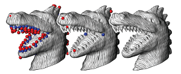
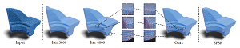

# A Survey on Work Related to Direction Field

Here is a list of related work on **direction field** that I have collected and complied.
I'm still working on it, so some of the information may not be complete.
I will update this list on a regular basis.

The emoji :white_check_mark: after the `[code]` or `[exe]` indicates that this code has been verified by me to be valid.

:clap: If you have any suggestions for improvements, please raise an issue or contact me.

# :page_with_curl: Papers

<!-- 00000000000000000000000000000000000000000000000000000000000000000000000000000000000 -->
<!-- 00000000000000000000000000000000000000000000000000000000000000000000000000000000000 -->
<!-- 00000000000000000000000000000000000000000000000000000000000000000000000000000000000 -->

## Cross Field

<table>
<!-- ----------------------------------------------------------------------------------- -->
<tr><td><td>

**Anisotropy and Cross Fields**

L. Simons, N. Amenta

05 August 2024, CGF

[[doi]](https://onlinelibrary.wiley.com/doi/10.1111/cgf.15132)
<!-- ----------------------------------------------------------------------------------- -->
<tr><td><td>

**Integrable Frame Fields using Odeco Tensors**

Mattéo Couplet, Alexandre Chemin, and Jean-François Remacle

2024, International Meshing Roundtable (IMR)

[[doi]](https://doi.org/10.1137/1.9781611978001.5)
<!-- ----------------------------------------------------------------------------------- -->
<tr><td><td>

**Singularity-Free Frame Fields for Line Drawing Vectorization**

Olga Guţan, Shreya Hegde, Erick Jimenez Berumen, Mikhail Bessmeltsev, Edward Chien

10 August 2023, CGF (EG 2023, SGP 2023 Best Paper Award Honorable mention)

[[doi]](https://doi.org/10.1111/cgf.14901) [[pdf]](https://olgagutan.com/wp-content/uploads/2023/11/singularityfreeff_paper_reducedsize.pdf) [[code]](https://github.com/SingularityFreeFrameFields/Code)
<!-- 
----------------------------------------------------------------------------------- -->
<tr><td><td>

**Frame Fields for CAD Models**

David Desobry, François Protais, [Nicolas Ray], Etienne Corman, Dmitry Sokolov

01 January 2022, Advances in Visual Computing

[[doi]](https://link.springer.com/chapter/10.1007/978-3-030-90436-4_34) [[pdf]](https://inria.hal.science/hal-03537852/document)
<!-- ----------------------------------------------------------------------------------- -->
<tr><td><td>

**Differentiable surface triangulation**

[Marie-Julie Rakotosaona], Noam Aigerman, Niloy J. Mitra, Maks Ovsjanikov, Paul Guerrero

10 December 2021, TOG

[[doi]](https://doi.org/10.1145/3478513.3480554) [[code]](https://github.com/mrakotosaon/diff-surface-triangulation)
<!-- ----------------------------------------------------------------------------------- -->
<tr><td><td>

**Polygonal Building Extraction by Frame Field Learning**

Nicolas Girard, Dmitriy Smirnov, [Justin Solomon], Yuliya Tarabalka

2021, CVPR

[[doi]](https://openaccess.thecvf.com/content/CVPR2021/html/Girard_Polygonal_Building_Extraction_by_Frame_Field_Learning_CVPR_2021_paper.html) [[pdf]](https://openaccess.thecvf.com/content/CVPR2021/papers/Girard_Polygonal_Building_Extraction_by_Frame_Field_Learning_CVPR_2021_paper.pdf) [[supp]](https://openaccess.thecvf.com/content/CVPR2021/supplemental/Girard_Polygonal_Building_Extraction_CVPR_2021_supplemental.pdf) [[code]](https://github.com/Lydorn/Polygonization-by-Frame-Field-Learning) 
<!-- ----------------------------------------------------------------------------------- -->
<tr><td><td>

**Towards untrimmed NURBS: CAD embedded reparameterization of trimmed B-rep geometry using frame-field guided global parameterization**

René R. Hiemstra, Kendrick M. Shepherd, Michael J. Johnson, Lulin Quan, Thomas J.R. Hughes

1 September 2020, CMAME

[[doi]](https://doi.org/10.1016/j.cma.2020.113227) 
<!-- ----------------------------------------------------------------------------------- -->
<tr><td><td>

**Octahedral Frames for Feature-Aligned Cross Fields**

Paul Zhang, Josh Vekhter, Edward Chien, [David Bommes], Etienne Vouga, [Justin Solomon]

24 April 2020, TOG

[[doi]](https://dl.acm.org/doi/10.1145/3374209) [[pdf]](https://dl.acm.org/doi/pdf/10.1145/3374209) [[code?]](https://github.com/the13fools/Feature-Aligned-Cross-Fields)
<!-- ----------------------------------------------------------------------------------- -->
<tr><td><td>

**Directional field synthesis, design, and processing**

[Amir Vaxman], [Marcel Campen], Olga Diamanti, [David Bommes], Klaus Hildebrandt, Mirela Ben-Chen Technion, [Daniele Panozzo]

30 July 2017, TOG

[[doi]](https://doi.org/10.1145/3084873.3084921) [[pdf]](https://cims.nyu.edu/gcl/papers/DirectionalFieldsSTAR-2016.pdf) [[code]](https://github.com/avaxman/DirectionalFieldSynthesis)
<!-- ----------------------------------------------------------------------------------- -->
<tr><td><td>

**Frame field generation through metric customization**

Tengfei Jiang, [Xianzhong Fang], [Jin Huang], [Hujun Bao], Yiying Tong, Mathieu Desbrun

27 July 2015, TOG

[[doi]](https://dl.acm.org/doi/10.1145/2766927) [[pdf]](https://www.geometry.caltech.edu/pubs/JFHB+15.pdf) [[errata]](http://www.cad.zju.edu.cn/home/hj/15/metric/errata.pdf)
<!-- ----------------------------------------------------------------------------------- -->
<tr><td><td>

**Integrable PolyVector fields**

Olga Diamanti, [Amir Vaxman], [Daniele Panozzo], [Olga Sorkine-Hornung]

27 July 2015, TOG (SIGGRAPH 2015)

[[doi]](https://doi.org/10.1145/2766906) [[pdf]](https://cims.nyu.edu/gcl/papers/integrable-polyvector-fields.pdf) [[project]](https://igl.ethz.ch/projects/integrable/)
<!-- ----------------------------------------------------------------------------------- -->
<tr><td><td>

**Designing N-PolyVector Fields with Complex Polynomials**

Olga Diamanti, [Amir Vaxman], [Daniele Panozzo], [Olga Sorkine-Hornung]

01 August 2014, CGF

[[doi]](https://dl.acm.org/doi/10.5555/2771589.2771590) [[pdf]](https://cims.nyu.edu/gcl/papers/n-polyvector-fields.pdf) [[project]](https://igl.ethz.ch/projects/complex-roots/) [[code]](https://igl.ethz.ch/projects/complex-roots/nPV.zip)
<!-- ----------------------------------------------------------------------------------- -->
<tr><td><td>

**Frame fields: anisotropic and non-orthogonal cross fields**

[Daniele Panozzo], [Enrico Puppo], [Marco Tarini], [Olga Sorkine-Hornung]

27 July 2014, TOG (SIGGRAPH 2014)

[[doi]](https://dl.acm.org/doi/10.1145/2601097.2601179) [[pdf]](https://cims.nyu.edu/gcl/papers/frame-fields-2014.pdf) [[project]](https://igl.ethz.ch/projects/frame-fields/) [[code - libigl]](http://www.inf.ethz.ch/personal/dpanozzo/libigl_tutorial/506_FrameField/main.cpp):no_entry_sign:
<!-- ----------------------------------------------------------------------------------- -->
<tr><td><td>

**Globally optimal direction fields**

Felix Knöppel, Keenan Crane, Ulrich Pinkall, Peter Schröder

21 July 2013, TOG

[[doi]](https://dl.acm.org/doi/10.1145/2461912.2462005) [[code]](https://github.com/GeometryCollective/fieldgen)
<!-- ----------------------------------------------------------------------------------- -->
<tr><td><td>

**Fields on symmetric surfaces**

[Daniele Panozzo], Yaron Lipman, [Enrico Puppo], [Denis Zorin]

01 July 2012, TOG

[[doi]](https://doi.org/10.1145/2185520.2185607) [[pdf]](https://cims.nyu.edu/gcl/papers/panozzo2012fss.pdf)
<!-- ----------------------------------------------------------------------------------- -->
<tr><td><td>

**General planar quadrilateral mesh design using conjugate direction field**

[Yang Liu], Weiwei Xu, Jun Wang, Lifeng Zhu, Baining Guo, Falai Chen, Guoping Wang

12 December 2011, TOG

[[doi]](https://doi.org/10.1145/2070781.2024174) [[pdf]](https://dl.acm.org/doi/pdf/10.1145/2070781.2024174)
<!-- ----------------------------------------------------------------------------------- -->
<tr><td><td>

**Interactive Visualization of Rotational Symmetry Fields on Surfaces**

Jonathan Palacios, Eugene Zhang

23 September 2010, TVCG

[[doi]](https://doi.org/10.1109/TVCG.2010.121)
<!-- ----------------------------------------------------------------------------------- -->
<tr><td><td>

**Geometry-aware direction field processing**

[Nicolas Ray], Bruno Vallet, Laurent Alonso, [Bruno Levy]

15 December 2009, TOG

[[doi]](https://doi.org/10.1145/1640443.1640444) [[pdf]](https://dl.acm.org/doi/pdf/10.1145/1640443.1640444)
<!-- ----------------------------------------------------------------------------------- -->
<tr><td><td>

**N-symmetry direction field design**

[Nicolas Ray], Bruno Vallet, Wan Chiu Li, [Bruno Lévy]

08 May 2008, TOG

[[doi]](https://dl.acm.org/doi/abs/10.1145/1356682.1356683)
<!-- ----------------------------------------------------------------------------------- -->
<tr><td><td>

**PRotational symmetry field design on surfaces**

Jonathan Palacios, Eugene Zhang

29 July 2007, TOG

[[doi]](https://doi.org/10.1145/1276377.1276446)
<!-- ----------------------------------------------------------------------------------- -->
<tr><td><td>

**Periodic global parameterization**

[Nicolas Ray], Wan Chiu Li, [Bruno Lévy], Alla Sheffer, Pierre Alliez

01 October 2006, TOG

[[doi]](https://dl.acm.org/doi/10.1145/1183287.1183297) [[pdf]](https://dl.acm.org/doi/pdf/10.1145/1183287.1183297)
<!-- ----------------------------------------------------------------------------------- -->
<tr><td><td>

**Robust Principal Curvatures on Multiple Scales**

Yong-Liang Yang, [Yu-Kun Lai], [Shi-Min Hu], Helmut Pottmann

2006, SGP

[[doi]](https://doi.org/10.2312/SGP/SGP06/223-226) [[pdf]](https://www.yongliangyang.net/docs/integralCurvature_sgp06.pdf)
<!-- ----------------------------------------------------------------------------------- -->
<tr><td><td>

**Smooth feature lines on surface meshes**

Klaus Hildebrandt, Konrad Polthier, Max Wardetzky

04 July 2005, SGP

[[doi]](https://dl.acm.org/doi/10.5555/1281920.1281935) [[pdf]](https://ddg.math.uni-goettingen.de/pub/feature.pdf) [[code?]](https://github.com/NYUGP17/SmoothFeatureLinesonSurfaceMeshes) [[code?]](https://github.com/Bushite/Smooth-Feature-Lines-Extraction)
<!-- ----------------------------------------------------------------------------------- -->
<tr><td><td>

**Restricted delaunay triangulations and normal cycle**

David Cohen-Steiner, Jean-Marie Morvan

08 June 2003, SCG

[[doi]](https://dl.acm.org/doi/abs/10.1145/777792.777839) [[pdf]](https://www.cs.jhu.edu/~misha/Fall09/Steiner03.pdf)
<!-- ----------------------------------------------------------------------------------- -->
<tr><td><td>

**Illustrating smooth surfaces**

Aaron Hertzmann, [Denis Zorin]

01 July 2000, SIGGRAPH

[[doi]](https://dl.acm.org/doi/10.1145/344779.345074) [[pdf]](https://dl.acm.org/doi/pdf/10.1145/344779.345074) [[project]](https://mrl.cs.nyu.edu/publications/illustrating-smooth/)
</table>

<!-- 00000000000000000000000000000000000000000000000000000000000000000000000000000000000 -->
<!-- 00000000000000000000000000000000000000000000000000000000000000000000000000000000000 -->
<!-- 00000000000000000000000000000000000000000000000000000000000000000000000000000000000 -->

## Frame Field

<table>
<!-- ----------------------------------------------------------------------------------- -->
<tr><td><td>

**Designing 3D Anisotropic Frame Fields with Odeco Tensors**

Haikuan Zhu, Hongbo Li, Hsueh-Ti Derek Liu, [Wenping Wang], Jing Hua, Zichun Zhong

27 July 2025, TOG

[[doi]](https://dl.acm.org/doi/10.1145/3731181) [[pdf]](https://dl.acm.org/doi/pdf/10.1145/3731181) [[code]](https://github.com/Ankbzpx/frame-field)
<!-- ----------------------------------------------------------------------------------- -->
<tr><td><td>

**Neural Octahedral Field: Octahedral prior for simultaneous smoothing and sharp edge regularization**

Ruichen Zheng, Tao Yu

1 August 2024, arXiv

[[doi]](https://arxiv.org/abs/2408.00303) [[pdf]](https://arxiv.org/pdf/2408.00303) [[code]](https://github.com/Ankbzpx/frame-field)
<!-- ----------------------------------------------------------------------------------- -->
<tr><td><td>

**A complex model decomposition algorithm based on 3D frame fields and features**

Chengpeng Zhang, Zhihua Yu, Jimin Shi, Yu Li, Wenqiang Xu, Zheyi Guo, Hongshi Zhang, Zhongyuan Zhu, Sheng Qiang

04 March 2024, Engineering Computations

[[doi]](https://www.emerald.com/insight/content/doi/10.1108/ec-01-2023-0037/full/html)
<!-- ----------------------------------------------------------------------------------- -->
<tr><td><td>

**Locally Meshable Frame Fields**

Heng Liu, [David Bommes]

26 July 2023, TOG

[[doi]](https://doi.org/10.1145/3592457) [[pdf]](https://dl.acm.org/doi/pdf/10.1145/3592457) [[project]](https://www.algohex.eu/publications/locally-meshable-frame-fields/) [[code in AlgoHex]](https://github.com/cgg-bern/AlgoHex)
<!-- ----------------------------------------------------------------------------------- -->
<tr><td><td>

**Metric-Driven 3D Frame Field Generation**

[Xianzhong Fang], [Jin Huang], Yiying Tong, [Hujun Bao]

17 December 2021, TVCG

[[doi]](https://ieeexplore.ieee.org/document/9655471) [[exe]](https://github.com/xianzhongfang/MetricDrivenFrame3D)
<!-- ----------------------------------------------------------------------------------- -->
<tr><td><td>

**Frame Field Operators**

D. Palmer, O. Stein, [J. Solomon]

23 August 2021, CGF (SGP)

[[doi]](https://doi.org/10.1111/cgf.14370) [[code]](https://github.com/dpa1mer/ff-op)
<!-- ----------------------------------------------------------------------------------- -->
<tr><td><td>

**Algebraic Representations for Volumetric Frame Fields**

David Palmer, [David Bommes], [Justin Solomon]

05 April 2020, TOG

[[doi]](https://dl.acm.org/doi/abs/10.1145/3366786) [[pdf]](https://dl.acm.org/doi/pdf/10.1145/3366786) [[code]](https://github.com/dpa1mer/arff)
<!-- ----------------------------------------------------------------------------------- -->
<tr><td><td>

**Multiple Approaches to Frame Field Correction for CAD Models**

[Maxence Reberol], Alexandre Chemin, Jean-Francois Remacle

9 Dec 2019, arXiv

[[doi]](https://doi.org/10.48550/arXiv.1912.01248) [[pdf]](https://arxiv.org/pdf/1912.01248) [[slides]](https://mxncr.github.io/pdf/slides_imr28_ffcorrection.pdf) [[CAD models]](https://mxncr.github.io/data/ff_correction_models.zip)
<!-- ----------------------------------------------------------------------------------- -->
<tr><td><td>

**Symmetric moving frames**

Etienne Corman, Keenan Crane

12 July 2019, TOG

[[doi]](https://dl.acm.org/doi/abs/10.1145/3306346.3323029) [[pdf]](https://par.nsf.gov/servlets/purl/10109860)
<!-- ----------------------------------------------------------------------------------- -->
<tr><td><td>

**Singularity-constrained octahedral fields for hexahedral meshing**

Heng Liu, Paul Zhang, Edward Chien, [Justin Solomon], [David Bommes]

30 July 2018, TOG

[[doi]](https://dl.acm.org/doi/10.1145/3197517.3201344) [[slides]](https://slides.games-cn.org/pdf/GAMES201857%E5%88%98%E8%A1%A1.pdf) [[code]](https://gitlab.vci.rwth-aachen.de:9000/SCOF/SingularityConstrainedOctahedralFields)
<!-- ----------------------------------------------------------------------------------- -->
<tr><td><td>

**Boundary Element Octahedral Fields in Volumes**

[Justin Solomon], [Amir Vaxman], [David Bommes]

16 July 2017, TOG

[[doi]](https://dl.acm.org/doi/abs/10.1145/3072959.3065254) [[pdf]](https://dspace.library.uu.nl/bitstream/handle/1874/360473/Boundary.pdf?sequence=1)
<!-- ----------------------------------------------------------------------------------- -->
<tr><td><td>

**Practical 3D frame field generation**

[Nicolas Ray], Dmitry Sokolov, [Bruno Lévy]

05 December 2016, TOG

[[doi]](https://dl.acm.org/doi/10.1145/2980179.2982408) [[code - in AlgoHex]](https://github.com/cgg-bern/AlgoHex) [[code - in supp]](https://dl.acm.org/doi/suppl/10.1145/2980179.2982408/suppl_file/233-0220.zip):white_check_mark:
<!-- ----------------------------------------------------------------------------------- -->
<tr><td><td>

**Analysis of Non-Meshable Automatically Generated Frame Fields**

Ryan Viertel, Matt Staten, Franck Ledoux

1 September 2016, 25th International Meshing Roundtable

[[doi]](https://www.sandia.gov/research/publications/details/analysis-of-non-meshable-automatically-generated-frame-fields-2016-09-01-1/) [[pdf]](https://www.osti.gov/servlets/purl/1375569)
<!-- ----------------------------------------------------------------------------------- -->
<tr><td><td>

**Frame field smoothness-based approach for hex-dominant meshing**

P.-E. Bernard, J.-F. Remacle, N. Kowalski, C. Geuzaine

March 2016, CAD

[[doi]](https://doi.org/10.1016/j.cad.2015.10.003)
<!-- ----------------------------------------------------------------------------------- -->
<tr><td><td>

**Smoothness driven frame field generation for hexahedral meshing**

N. Kowalski, F. Ledoux, P. Frey

March 2016, CAD

[[doi]](https://doi.org/10.1016/j.cad.2015.06.009)
<!-- ----------------------------------------------------------------------------------- -->
<tr><td><td>

**Frame Field Singularity Correctionfor Automatic Hexahedralization**

Tengfei Jiang, [Jin Huang], Yuanzhen Wang, Yiying Tong, [Hujun Bao]

04 November 2013, TVCG

[[doi]](https://ieeexplore.ieee.org/abstract/document/6654167) [[pdf]](http://www.cad.zju.edu.cn/home/bao/pub/Frame_Field_Singularity_Correction_for_Automatic_Hexahedralization.pdf)
<!-- ----------------------------------------------------------------------------------- -->
<tr><td><td>

**Boundary aligned smooth 3D cross-frame field**

[Jin Huang], Yiying Tong, Hongyu Wei, [Hujun Bao]

12 December 2011, TOG

[[doi]](https://doi.org/10.1145/2070781.2024177) [[pdf]](https://dl.acm.org/doi/pdf/10.1145/2070781.2024177) [[video]](http://www.cad.zju.edu.cn/home/hj/11/3D-cross-frame.avi) [[exe]](http://www.cad.zju.edu.cn/home/hj/11/SH-cross-frame-1607-JiongCHEN.7z)
</table>

<!-- 00000000000000000000000000000000000000000000000000000000000000000000000000000000000 -->
<!-- 00000000000000000000000000000000000000000000000000000000000000000000000000000000000 -->
<!-- 00000000000000000000000000000000000000000000000000000000000000000000000000000000000 -->

# :movie_camera: Slides

<table>
<!-- ----------------------------------------------------------------------------------- -->
<tr><td><td>

**Bringing frame fields from research to industrial usage**
Franck Ledoux
1-2 July 2019
[[pdf]](https://www.hextreme.eu/frames2019/slides/slides_ledoux.pdf)
</table>

# :hammer: Other Projects

- Directional - A Directional-Field Processing Library [[project]](https://avaxman.github.io/Directional/) [[code]](https://github.com/avaxman/Directional):white_check_mark:
- TinyAD - A C++ header-only library for second-order automatic differentiation [[frame field optimization]](https://github.com/patr-schm/TinyAD?tab=readme-ov-file#frame-field-optimization) [[project]](https://www.graphics.rwth-aachen.de/publication/03341/) [[code]](https://github.com/patr-schm/TinyAD) 

# :floppy_disk: Softwares

[Alexander Gao]: https://www.alexandergao.com/
[Alexander Sorkine-Hornung]: https://www.sornlex.com/
[Amir Vaxman]: https://avaxman.github.io
[Bruno Lévy]: https://brunolevy.github.io/
[Claudio Silva]: https://engineering.nyu.edu/faculty/claudio-silva
[Daniel Zint]: https://daniel-zint.github.io/
[Daniele Panozzo]: https://cims.nyu.edu/gcl/daniele.html
[David Bommes]: https://www.graphics.rwth-aachen.de/person/6/
[Denis Zorin]: https://cims.nyu.edu/gcl/denis.html
[Dong-Ming Yan]: https://people.ucas.ac.cn/~dmyan
[Enrico Puppo]: https://person.dibris.unige.it/puppo-enrico/
[Gang Xu]: https://faculty.hdu.edu.cn/jsjxy/xg/main.htm
[Hans-Christian Ebke]: https://www.graphics.rwth-aachen.de/person/10/
[Hsueh-Ti Derek Liu]: https://www.dgp.toronto.edu/~hsuehtil/
[Hujun Bao]: http://www.cad.zju.edu.cn/home/bao/
[Kenshi Takayama]: https://kenshi84.github.io/
[Leif Kobbelt]: https://www.graphics.rwth-aachen.de/person/3/
[L. Kobbelt]: https://www.graphics.rwth-aachen.de/person/3/
[Jin Huang]: http://www.cad.zju.edu.cn/home/hj/index.xml
[Justin Solomon]: https://people.csail.mit.edu/jsolomon/
[J. Solomon]: https://people.csail.mit.edu/jsolomon/
[M. Campen]: https://graphics.cs.uos.de/
[M. Lyon]: https://www.graphics.rwth-aachen.de/person/99/
[Marcel Campen]: https://graphics.cs.uos.de/
[Marco Livesu]: http://pers.ge.imati.cnr.it/livesu/
[Marco Tarini]: https://tarini.di.unimi.it/
[Marie-Julie Rakotosaona]:https://www.lix.polytechnique.fr/Labo/Marie-Julie.RAKOTOSAONA/
[Martin Marinov]: https://www.graphics.rwth-aachen.de/person/43/
[Max Lyon]: https://www.graphics.rwth-aachen.de/person/99/
[Maxence Reberol]: https://mxncr.github.io
[Ming C. Lin]: https://www.cs.umd.edu/~lin/
[Na Lei]: http://conformalgeometry.org/~lei/
[Nicolas Ray]: https://members.loria.fr/NRay/
[Nico Pietroni]: https://www.nicopietroni.com/
[Nico Schertler]: https://nschertler.github.io/
[Olga Sorkine-Hornung]: https://igl.ethz.ch/people/sorkine/
[Paolo Cignoni]: https://vcg.isti.cnr.it/~cignoni/
[Patrick Schmidt]: https://patr-schm.github.io/
[Riccardo Scateni]: https://web.unica.it/unica/page/it/riccardo_scateni
[Shi-Min Hu]: https://cg.cs.tsinghua.edu.cn/shimin.htm
[Stefano Nuvoli]: https://github.com/stefanonuvoli
[Wenping Wang]: https://engineering.tamu.edu/cse/profiles/Wang-Wenping.html
[Xianfeng Gu]: https://www3.cs.stonybrook.edu/~gu/
[Xianzhong Fang]: https://xzfang.top/
[Xingyi Du]: https://duxingyi-charles.github.io/
[Yang Liu]: https://xueyuhanlang.github.io/
[Yu-Kun Lai]: https://users.cs.cf.ac.uk/Yukun.Lai/